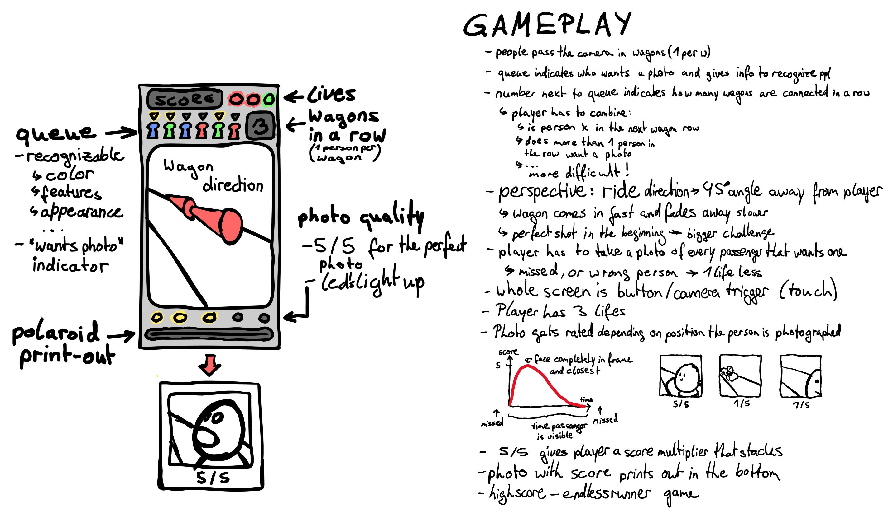

# Coaster Cam (Prototype)

## Description
"Coaster Cam" is a reaction based "one button" game prototype made in Unity.
The goal is to shoot photos of people, who attend a roller coaster ride.
Your skills are measured by the quality and timing of the photos.
When photos of people are taken who don't want to be photographed, you will loose a life.

## Concepts

## License
The [license](https://github.com/BigETI/CoasterCam/blob/master/LICENSE) for this project is available at: https://github.com/BigETI/CoasterCam/blob/master/LICENSE